# Architecture

## Multi-agent orchestration



`AnalyticsPipeline` (`src/semantic_query_engine/pipeline/orchestrator.py`) chains five agents:

```
question --> Planner --> Schema Retriever --> SQL Generator --> Validator --(repair loop)--> Synthesis
```

- **Planner** (`agents/planner.py`) is a deterministic, keyword/regex-based classifier --
  no LLM call. This is a deliberate choice, not an unfinished corner: intent
  classification here is a cheap, explainable pre-filter, and every dimension value it
  matches against comes from the same registry the rest of the system uses (see below),
  not a separate hardcoded list. A vague question ("How did the promotion do?") is
  flagged `AMBIGUOUS` and returns a clarification prompt instead of guessing.
- **Schema Retriever** (`agents/schema_retriever.py` / `semantic/retriever.py`) grounds
  the question against the active domain's semantic layer: vector search when an
  embeddings-capable provider is configured (cached per domain, keyed by embedding model
  so a model change can't silently serve stale vectors), keyword overlap otherwise. See
  [Two domains, one contract](#two-domains-one-contract) for where those paths come from.
- **SQL Generator** (`agents/sql_generator.py`) is LLM-primary with a deterministic
  fallback: an LLM call when a provider is configured, or a declarative `QueryTemplate`
  registry otherwise (a `matches`/`render` pair per question shape -- SKU lookup,
  year-over-year, promotion split, stock depletion, week-on-week, monthly trend, cross-tabs,
  ...). LLM JSON output is parsed through Pydantic models (`core/schemas.py`) with one
  retry before falling back, so a malformed response fails legibly instead of degrading
  into an empty-string SQL statement three layers downstream.
- **Validator** (`agents/validator.py`) parses the candidate SQL into an AST via
  `sqlglot` -- not regex -- and enforces: SELECT/WITH only, an allow-listed table set,
  columns resolved *per `SELECT` scope* against the live DuckDB schema (so a column that
  exists on another allowed table is not accepted in a query that never reads it, and a
  column supplied by two joined tables is reported as ambiguous), a bounded result set,
  and that any certified metric named in the question (revenue, stock depletion,
  promotional uplift) was actually computed via its registered formula. A query that
  arrives without a `LIMIT` has `PIPELINE.max_result_rows` injected rather than being
  trusted to be small; the capped result is flagged as such all the way to the UI. The
  same rewrite step injects the caller's row-security predicate and rejects derived
  expressions over personal-data columns -- see [Governance](#governance-enforcement-at-the-query-plan-layer). Every
  rejection carries a stable `IssueCode` alongside its message, so rejection reasons can
  be aggregated across an evaluation run instead of string-matched. On failure, up to `PIPELINE.max_repair_attempts`
  repair rounds feed the validator's errors back into the generator -- but only when an
  LLM is configured to actually act on that feedback. The deterministic fallback is a
  pure function of the question text, so a repair attempt that reproduces the same SQL
  that just failed is reported as `source="fallback_unrepairable"` and the orchestrator
  stops immediately rather than burning the rest of the repair budget on an identical
  query (see `CHANGELOG.md`).
- **Synthesis** (`agents/synthesis.py`) turns the result `DataFrame` into a 5-layer
  response (narrative, key metric, comparison, chart recommendation, SQL for audit),
  again LLM-primary with a deterministic fallback.

Every LLM-calling agent follows the same **try-the-LLM, fall back on any failure** shape
(`core/schemas.llm_retry` gives one retry first) -- a missing API key, a provider outage,
or rate limiting all degrade the product instead of breaking it. The orchestrator raises
the typed exceptions in `core/errors.py` internally (`ClarificationNeededError`,
`SQLValidationError`, `QueryExecutionError`, `NoDataError`, `WarehouseError`) and converts
them in exactly one place (`AnalyticsPipeline.run`) into the discriminated union in
`core/results.py` -- `StructuredResponse` (`kind="answer"`), `Clarification`, or `Failure`
with a closed `reason` -- rather than building an untyped dict ad hoc at each error site.
Callers branch on `result.kind` and every variant serialises via `to_dict()`.
`WarehouseError` (raised by
`warehouse/duckdb_client.py` when the DuckDB file can't be opened -- locked, corrupt, or a
permissions error) is the one exception type raised outside `AnalyticsPipeline.run`,
since it can happen before a pipeline even exists. Both entry points catch it at
construction: the CLI turns it into exit code 3 (`cli/main._build_pipeline`), and the API
raises it from the lifespan handler so a container with an unopenable warehouse fails at
boot rather than serving 500s.

## Warehouse connection lifecycle

`warehouse/duckdb_client.get_connection()` opens a new `duckdb.connect()` handle on every
call -- it doesn't cache one itself, so whoever owns the process decides how many exist.
`api/app.py` builds one `AnalyticsPipeline` in its lifespan handler and shares it for the
life of the server, which means one DuckDB connection per process rather than one per
request. The CLI constructs a pipeline per invocation and exits, so it simply takes the
default. Scripts and tests that construct `AnalyticsPipeline()` with no `conn` argument get
a connection via `get_connection()` directly -- fine for a short-lived process, not for a
long-running server.

That shared connection is never used for a query directly. A `DuckDBPyConnection` is not
safe to use from two threads at once, so `AnalyticsPipeline.run` takes its own cursor from
it via `open_cursor()` for the duration of one question and closes it in a `finally` --
without that, concurrent requests raise `No open result set` or `Connection already
closed`. Every connection and cursor is opened with `PIPELINE.warehouse_memory_limit` and
`warehouse_threads` applied, and queries execute through `execute_guarded()`, which
enforces `PIPELINE.query_timeout_seconds` by interrupting the query from a timer (DuckDB
has no statement timeout) and raises `QueryTimeoutError` so a cancelled query is reported
distinctly from an invalid one. The point of all three is the same: the SQL reaching this
layer was written by a model, so it is bounded in rows, memory and wall-clock before it
runs.

## The domain registry: one source of truth for business rules



The active domain's `semantic_layer.json` is the *only* place a certified metric formula
or a dimension's allowed values are written down -- `data/semantic/semantic_layer.json`
for retail, `data/domains/airline/semantic_layer.json` for airline, each named by that
domain's manifest rather than by a constant in Python.
`src/semantic_query_engine/domain/registry.py` loads it into five registries, returned as
one `DomainRegistries` bundle:

- **`MetricRegistry`** parses each formula with `sqlglot` once, at load time, to derive
  the columns and arithmetic operators (multiplication/division) it structurally requires.
  The validator's metric-contract check, the SQL fallback templates' formula strings, and
  the LLM prompt's "Business Metric Definitions" section all read from the same
  `MetricDefinition` objects -- changing a formula means editing the JSON once.
- **`DimensionRegistry`** holds the allowed literal values per dimension (region, channel,
  brand, category, pack type) plus a small alias table for how a question might phrase
  them ("ready meal" -> `ReadyMeal`, "north" -> `PL-North`). The planner's entity
  extraction, the SQL fallback's dimension matching, and the LLM prompt's "Dimension
  Values" section all read from here.
- **`IdentifierRegistry`** holds regex patterns for high-cardinality identifiers (SKU,
  store, promotion codes) that are impractical to enumerate as dimension values.
- **`GrainRegistry`** holds what one row of each table *means*: its key columns, which of
  its measures are additive, which are levels, the declared join paths between tables,
  and the temporal role of each date column. See the grain section below.
- **`LanguageProfile`** holds the domain's *vocabulary*: the planner's keyword sets, the
  topic prompts behind a clarification, the few-shot SQL examples and the questions
  `sqe examples` prints. A keyword tuple or a worked SQL example written in Python is a
  fifth copy of domain data that no longer changes when the domain does.

Row policies and PII tags live in the same file but do not come through the registries --
`governance/policy.py` reads them directly, because they are consumed at validator
construction rather than by an agent. Same source of truth, different reader.

Before this registry existed, the revenue formula (`units_sold * price_unit`) and the
dimension value lists each existed independently in up to four places (the semantic
layer, the prompt, the fallback templates, and the validator) -- changing one meant
finding and editing all of them correctly, or the validator could silently end up
enforcing a formula the prompt no longer taught.

## Two domains, one contract

There are two warehouses -- `retail` (the default) and `airline` -- and the same five
agents serve either with no code change. What makes that true is that nothing resolves a
warehouse, a semantic layer, an embedding cache, a gold set, a query cache, a principal
set or an audit log from a module constant. They all come from a **manifest**,
`data/domains/<name>/domain.json`, loaded into the frozen `Domain` dataclass in
`core/domains.py`. `sqe domains` prints them and says which is active.

Two properties of that dataclass are load-bearing:

- **It is frozen, and selected once.** `--domain` (or `SQE_DOMAIN`) is resolved *before*
  any agent is constructed, because agents capture the semantic layer and the allowed-table
  set at construction. A domain that could be swapped afterwards would give an already-built
  agent a stale warehouse and a live semantic layer. The active domain is process-global
  for the same reason: threading it through every constructor would put a domain argument
  on code that has no business knowing domains exist, and each surface serves one domain
  per process.
- **`allowed_tables` is derived, not declared.** It is read from the domain's semantic
  layer rather than listed again in the manifest, so the two cannot disagree about what
  exists.

Per-domain-ness extends to the things that look incidental. The semantic cache is one file
per domain -- a shared one would let a retail question match an airline one on the filler
words they share and return SQL over tables that do not exist, caught by the validator but
only after the cache had skipped the generation that would have been right. The audit log
is per domain too, so "every query against the retail data" is a file rather than an
exercise in filtering.

The two are not interchangeable in one respect, and it is deliberate. **Retail's numbers
are a published baseline** -- total revenue is 19,951,300.58 to the cent, and every gold
answer scores against it. New dirty data, new defects and new experiments therefore go in
`airline`, which has no published figure to protect. That is why the SCD over-granting bug
and the fan-out cases live there.

## The warehouse: a star schema, and why grain is declared

Retail's warehouse is seven tables, generated from one source CSV by
`scripts/build_star_schema.py` under a fixed seed:



Key columns only; `sqe schema` prints the rest.

Descriptive attributes live only in the dimensions, so a question about category or
region cannot be answered without a join. The ambiguity is deliberate: `region` appears
on both `dim_store` and `weekly_modeling_data`, `units_sold` exists at three different
grains, and `fmcg_sales.date` (a day) sits next to `weekly_modeling_data.week` (a week
start) as two plausible-looking date columns.

That last group is the point of the whole exercise. Every other rule in the validator
catches SQL that *fails* -- it refers to something that does not exist, or it will not
plan. A grain mistake does none of that. Joining sales to inventory on `(sku, date)`
looks entirely reasonable, parses, plans, runs in milliseconds, and returns **21,114,387
units against a true 3,799,824**: a 5.6x overstatement that raises nothing and looks
like an answer. It is the purest form of the confidently-wrong failure the evaluation
layer measures, and it is invisible to every other check here.

So grain is *declared*, in `semantic_layer.json`, and the validator decides structurally:

1. Collect the equality keys tying each pair of sources together -- from `ON`, from
   `USING`, and from top-level `WHERE` conjunctions, because `FROM a, b WHERE a.id = b.id`
   multiplies rows exactly as an explicit join does.
2. A join is **grain-safe** when those keys cover the full declared grain of at least one
   side: that side contributes at most one row per row of the other, so nothing is
   multiplied.
3. An uncovered join is only *rejected* when an additive measure from a multiplied source
   is actually summed. `SELECT DISTINCT` over a many-to-many join is legitimate SQL and
   stays legitimate.

The asymmetry matters: this check must never call an unsafe join safe. So equalities
under an `OR` are never counted as keys (they do not constrain every row), a join whose
`ON` yields no usable key is treated as unsafe rather than unanalysable, and a subquery's
grain -- which is whatever its own `GROUP BY` produced, and is declared nowhere -- is
treated as unanalysable rather than unsafe, because pre-aggregating each side is the
standard *fix* for a fan-out and must not itself be rejected.

Three issue codes come out of it: `grain_fanout`, `grain_key_mismatch` (a day equated to
a week start) and `unrelated_join` (no join condition at all).

Grain also reaches the prompt, not just the validator. Telling the model that one
`fmcg_sales` row is one SKU in one store on one day prevents generations that would
otherwise cost a repair round-trip.

## Governance: enforcement at the query-plan layer

Access control lives in `governance/`, and the decision that shapes everything else is
*where* it is enforced: on the parsed tree, inside the validator, between generation and
execution. Not in the prompt, which asks the model to cooperate; not as a view layer,
which the model can route around; not after the fact in the result set, by which point
the warehouse has already read the rows. The validator already rewrites the AST to
inject a `LIMIT`, so predicate injection is the same mechanism pointed at a second
problem.



Four modules, split along the line that matters:

```
governance/
├── policy.py       # what the DOMAIN declares: row policies, PII tags (semantic layer)
├── principals.py   # who is asking and what they hold (deployment's principals.json)
├── row_security.py # predicate injection + the re-derived breach check
├── masking.py      # which output columns are personal data, and what a caller sees
├── audit.py        # append-only, hash-chained record of every run
└── telemetry.py    # run_id contextvar, per-stage spans, optional OTel bridge
```

`policy` and `principals` are separate on purpose. A policy is a fact about the
warehouse, version-controlled alongside it; an identity is a fact about a deployment --
it changes when somebody joins a team, it differs between staging and production, and
it is the part a real system reads from an identity provider. Keeping them apart is
what lets `principals.json` be replaced by an OIDC token without touching the policy.

**Policies are captured at validator construction; the principal is a per-call
argument.** This mirrors the registries: the policy is domain data, resolved once, and
one API server therefore shares one validator across every caller, while identity
travels with the request.

### Three fail-closed choices

Each of these has a shorter, more obvious alternative that is wrong.

- **Empty grants compile to `FALSE`, not to an absent predicate.** An empty `IN` list is
  a syntax error, and the reflex fix -- omit the predicate -- promotes the least
  privileged principal to the most privileged.
- **Facts are scoped by a semi-join on their own key**, not by filtering a joined
  dimension. "Add `dim_store.region = ...` when the query joins `dim_store`" leaks every
  query that does not join it. Every `SELECT` in the tree is scoped, not only the
  outermost, or a CTE body reads the whole table.
- **A semi-join through a slowly-changing dimension is closed on its validity window.**
  "Did this key ever belong to a granted scope" is a wider question than "did it belong
  to one when this row happened", and the gap is real data: airline's two transferred
  airframes handed both the old and the new operator the whole of their fuel history
  until this was fixed on 2026-09-21. Declared per scope with `valid_from` / `valid_to`
  / `as_of`, all three or none -- a half-written declaration is refused at load rather
  than degrading to the wider predicate. The window is half-open, so a changeover date
  belongs to exactly one scope.
- **An unknown principal id is an error, not an anonymous fallback.** Resolving it to
  "no grants" would also be safe; resolving it to a default would not, and a typo in a
  caller's identity must not quietly become someone else's access. Unrestricted is
  likewise explicit (`unrestricted: true`), never inferred from a missing `grants` key
  -- which is what a half-written principal looks like.

The process default is the unrestricted `STEWARD`, and that is a compatibility decision
worth stating plainly rather than a security one: every published number -- retail's
19,951,300.58, every gold-set score -- was measured without row restriction, and a
filtering default would silently move all of them. Restriction is opt-in per call, and
the audit log records which principal each run actually ran as.

### Verification is re-derived, not trusted

`scope_breaches()` re-parses the final SQL and asks whether the required predicates are
present as top-level `AND` conjuncts. It deliberately does not consult the injector's
own bookkeeping -- the same principle as `report.executed_unsafely()`, which re-derives
containment from the SQL that ran rather than from the validator's verdict. A component
that reports on itself cannot catch the case where it silently stopped running. A
predicate smuggled under an `OR` does not count as scoped.

For the same reason, **row policies are not ablatable**. `ValidatorAgent.safety_only()`
exists so the eval ladder can strip semantic checks and measure their contribution; it
refuses a restricted principal outright rather than serving it unfiltered. Semantic
checks are an experimental variable; access control is not.

`GovernancePolicy.unguarded_tables()` closes the decay path: any table carrying the
scoping column or the anchor table's grain key must declare a scope, and a parametrised
test asserts the set is empty for both domains. A table added later without a policy
fails the suite instead of quietly serving everything.

### PII: masked on the way out, rejected on the way in

Tagged columns are masked in the result per the caller's clearance, resolved against the
parsed sources so the tag survives an alias, a `SELECT *` and a CTE. Row scope and PII
clearance are independent axes -- the airline domain carries two principals with
identical grants and different clearances to make that concrete.

A **derived expression over a tagged column is rejected** (`IssueCode.PII_DERIVED`)
rather than masked. `UPPER(crew_email)` discloses in the warehouse before a result row
exists; masking the output would be theatre. `COUNT` is exempt, since it discloses
nothing about any individual.

### Audit

One record per run, for every outcome -- answers, clarifications and failures alike,
because a refused query is exactly the one an auditor goes looking for. Each record's
digest covers its own content and its predecessor's hash, so an in-place edit breaks the
chain rather than rewriting history, and `sqe audit --verify` replays every link and
exits 1 on a mismatch. The log is a deployment artefact: `data/audit/` is gitignored and
`SQE_AUDIT=0` disables it for the unit tier.

### Telemetry

`run_id` is a contextvar, so it tags every log line in both the human and
`SQE_LOG_FORMAT=json` renderers without being threaded through every signature.
`RunTrace` gained a per-stage `SpanRecorder`; `stage_latency_ms` reaches every result
payload and renders under `--explain`. The OpenTelemetry bridge is optional and is *not*
a dependency -- absent the SDK it is a no-op, and `SQE_OTEL=0` disables it outright. A
governance layer that cannot be installed without a tracing stack would not be installed.

## Testing strategy

`tests/unit/` mocks the LLM client (`tests/unit/fakes.py::FakeChatClient`) and runs
against an ephemeral DuckDB file set via `SQE_DUCKDB_PATH` in `tests/conftest.py` --
no network, no API key, and it never touches the developer's real warehouse file.
`tests/integration/` exercises the actually-configured LLM provider and is excluded by
default (`pytest -m integration` to opt in; skips cleanly with no key configured).
`evals/harness.py` is the one gold-evaluation harness, asserting both structural shape
(intent, required columns) and, where an `expected_values` block is present, numeric
correctness within a tolerance; `sqe eval` and `python -m evals.gate` are the two
entry points onto it, and the unit tier tests the scorer rather than running the suite.

A third tier sits alongside the example-based tests: `tests/unit/test_validator_properties.py`
fuzzes the validator with `hypothesis` and asserts a single invariant -- no mutating
statement ever validates. It is not redundant with the example tests. On its first run
it found `TRUNCATE TABLE fmcg_sales; SELECT 1` validating as safe, against a suite that
had been green for four phases: `sqlglot.parse_one` folds stacked statements into one
`exp.Block` that satisfies `find(exp.Select)`, and DuckDB executes both halves. The
validator now parses with plural `sqlglot.parse()` and refuses anything that is not
exactly one statement, and `exp.Command` -- what sqlglot parses unmodelled SQL into --
counts as mutating, because SQL the validator cannot analyse is precisely what it must
not wave through.
