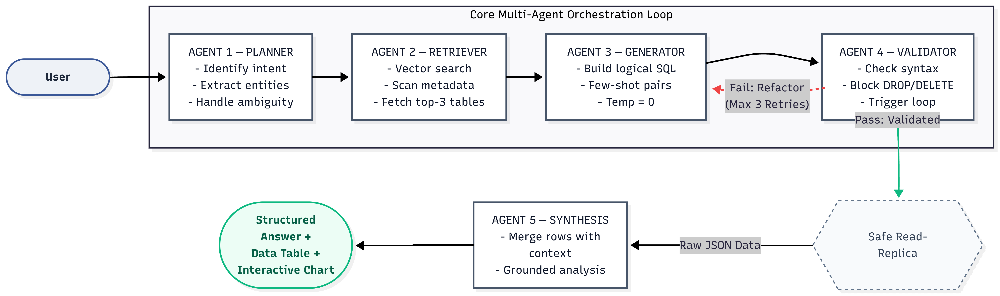
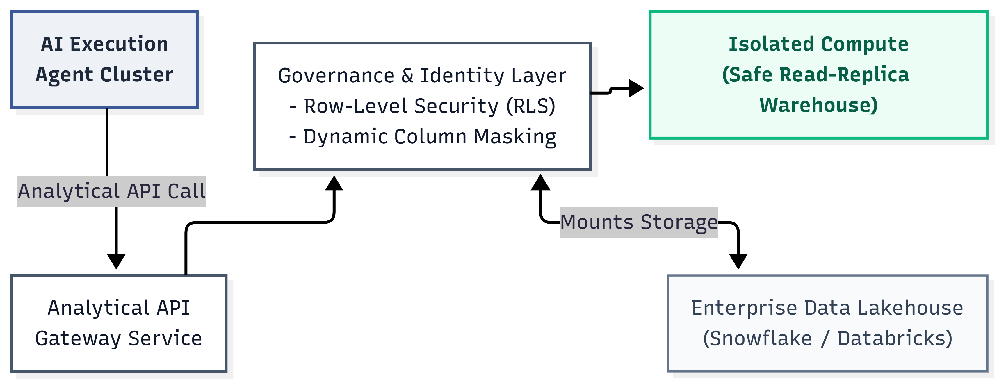

# Architecture

## Multi-agent orchestration



`AnalyticsPipeline` (`src/semantic_query_engine/pipeline/orchestrator.py`) chains five agents:

```
question --> Planner --> Schema Retriever --> SQL Generator --> Validator --(repair loop)--> Synthesis
```

- **Planner** (`agents/planner.py`) is a deterministic, keyword/regex-based classifier --
  no LLM call. This is a deliberate choice, not an unfinished corner: intent
  classification here is a cheap, explainable pre-filter, and every dimension value it
  matches against comes from the same registry the rest of the system uses (see below),
  not a separate hardcoded list. A vague question ("How did the promotion do?") is
  flagged `AMBIGUOUS` and returns a clarification prompt instead of guessing.
- **Schema Retriever** (`agents/schema_retriever.py` / `semantic/retriever.py`) grounds
  the question against `data/semantic/semantic_layer.json`: vector search when an
  embeddings-capable provider is configured (cached to `data/semantic/embedding_cache.json`,
  keyed by embedding model so a model change can't silently serve stale vectors), keyword
  overlap otherwise.
- **SQL Generator** (`agents/sql_generator.py`) is LLM-primary with a deterministic
  fallback: an LLM call when a provider is configured, or a declarative `QueryTemplate`
  registry otherwise (a `matches`/`render` pair per question shape -- SKU lookup,
  year-over-year, promotion split, stock depletion, week-on-week, monthly trend, cross-tabs,
  ...). LLM JSON output is parsed through Pydantic models (`core/schemas.py`) with one
  retry before falling back, so a malformed response fails legibly instead of degrading
  into an empty-string SQL statement three layers downstream.
- **Validator** (`agents/validator.py`) parses the candidate SQL into an AST via
  `sqlglot` -- not regex -- and enforces: SELECT/WITH only, an allow-listed table set,
  known columns against the live DuckDB schema, a bounded `LIMIT`, and that any certified
  metric named in the question (revenue, stock depletion, promotional uplift) was actually
  computed via its registered formula. On failure, up to `PIPELINE.max_repair_attempts`
  repair rounds feed the validator's errors back into the generator -- but only when an
  LLM is configured to actually act on that feedback. The deterministic fallback is a
  pure function of the question text, so a repair attempt that reproduces the same SQL
  that just failed is reported as `source="fallback_unrepairable"` and the orchestrator
  stops immediately rather than burning the rest of the repair budget on an identical
  query (see `CHANGELOG.md`).
- **Synthesis** (`agents/synthesis.py`) turns the result `DataFrame` into a 5-layer
  response (narrative, key metric, comparison, chart recommendation, SQL for audit),
  again LLM-primary with a deterministic fallback.

Every LLM-calling agent follows the same **try-the-LLM, fall back on any failure** shape
(`core/schemas.llm_retry` gives one retry first) -- a missing API key, a provider outage,
or rate limiting all degrade the product instead of breaking it. The orchestrator raises
the typed exceptions in `core/errors.py` internally (`ClarificationNeededError`,
`SQLValidationError`, `QueryExecutionError`, `NoDataError`, `WarehouseError`) and converts
them to the response dict the UI renders in exactly one place (`AnalyticsPipeline.run`),
rather than building that dict ad hoc at each error site. `WarehouseError` (raised by
`warehouse/duckdb_client.py` when the DuckDB file can't be opened -- locked, corrupt, or a
permissions error) is the one exception type raised outside `AnalyticsPipeline.run`,
since it can happen before a pipeline even exists; `ui/app.py` catches it once at startup.

## Warehouse connection lifecycle

`warehouse/duckdb_client.get_connection()` opens a new `duckdb.connect()` handle on every
call -- it doesn't cache one itself. `ui/app.py` wraps it in `get_shared_connection()`,
cached per-process via `st.cache_resource`, and that same connection is passed into both
`AnalyticsPipeline(conn=...)` and the dashboard's `get_dataset_stats`. This means the whole
Streamlit server process holds exactly one DuckDB connection, reused across every rerun and
every browser session, instead of leaking a new one per session. Scripts and tests that
construct `AnalyticsPipeline()` with no `conn` argument still get a connection via
`get_connection()` directly -- fine for a short-lived process, not for a long-running server.

## The domain registry: one source of truth for business rules



`data/semantic/semantic_layer.json` is the *only* place a certified metric formula or a
dimension's allowed values are written down. `src/semantic_query_engine/domain/registry.py` loads it
into two registries:

- **`MetricRegistry`** parses each formula with `sqlglot` once, at load time, to derive
  the columns and arithmetic operators (multiplication/division) it structurally requires.
  The validator's metric-contract check, the SQL fallback templates' formula strings, and
  the LLM prompt's "Business Metric Definitions" section all read from the same
  `MetricDefinition` objects -- changing a formula means editing the JSON once.
- **`DimensionRegistry`** holds the allowed literal values per dimension (region, channel,
  brand, category, pack type) plus a small alias table for how a question might phrase
  them ("ready meal" -> `ReadyMeal`, "north" -> `PL-North`). The planner's entity
  extraction, the SQL fallback's dimension matching, and the LLM prompt's "Dimension
  Values" section all read from here.

Before this registry existed, the revenue formula (`units_sold * price_unit`) and the
dimension value lists each existed independently in up to four places (the semantic
layer, the prompt, the fallback templates, and the validator) -- changing one meant
finding and editing all of them correctly, or the validator could silently end up
enforcing a formula the prompt no longer taught.

## Testing strategy

`tests/unit/` mocks the LLM client (`tests/unit/fakes.py::FakeChatClient`) and runs
against an ephemeral DuckDB file set via `SQE_DUCKDB_PATH` in `tests/conftest.py` --
no network, no API key, and it never touches the developer's real warehouse file.
`tests/integration/` exercises the actually-configured LLM provider and is excluded by
default (`pytest -m integration` to opt in; skips cleanly with no key configured).
`evals/gold_eval.py` is the one gold-evaluation harness, asserting both structural shape
(intent, required columns) and, where an `expected_values` block is present, numeric
correctness within a tolerance -- called by both the pytest gold-eval tests and the
standalone `evals/run_gold_eval.py` report.
