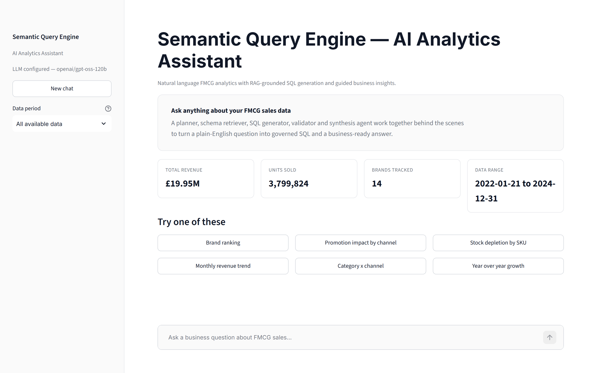
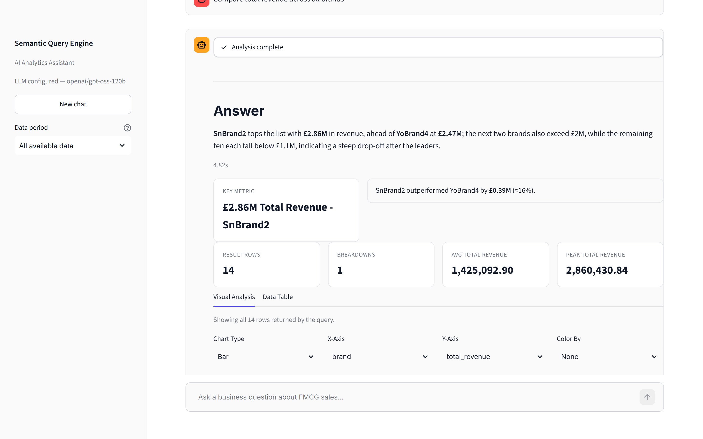
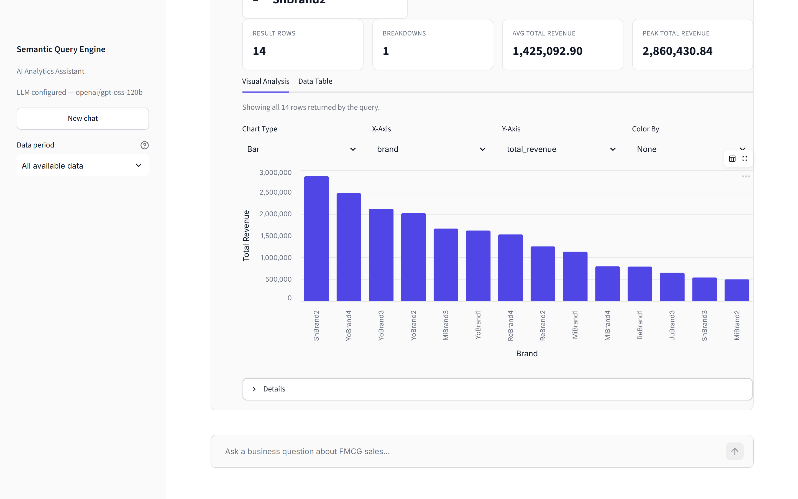
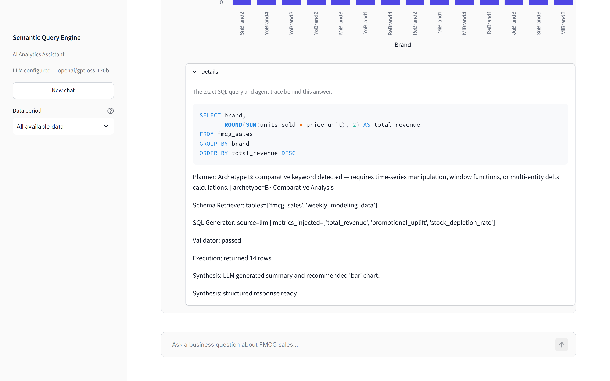

# Semantic Query Engine

Natural-language analytics assistant for FMCG sales data. Ask a plain-English business
question; get governed SQL and a structured, business-ready answer back.

## A look at it



*The dataset at a glance, with starter questions so nobody faces a blank prompt.*



*Every answer leads with a plain-English summary, the key metric, and how it compares to
the next-best value -- not just a table.*



*The synthesis agent recommends a chart type; the axes, series and colour are yours to
change inline, and the raw rows are one tab away.*



*Nothing is a black box. **Details** shows the exact SQL that ran and the full agent trace
-- planner archetype, retrieved tables, injected metric formulas, validator verdict, row
count -- so any answer can be audited or reproduced.*

## What it is

A five-agent pipeline turns a question like *"Which brand had the highest promotional
uplift?"* into validated DuckDB SQL and a narrative answer:

1. **Planner** classifies intent (lookup / comparative / diagnostic / needs clarification)
   and extracts entities (SKU, region, timeframe, metric, ...).
2. **Schema Retriever** grounds the question against `data/semantic/semantic_layer.json`
   (table/column descriptions and certified business-metric formulas), via vector search
   when an embeddings-capable provider is configured, or keyword overlap otherwise.
3. **SQL Generator** produces SQL -- an LLM call when a provider is configured, a
   declarative template bank otherwise (see `src/semantic_query_engine/agents/sql_generator.py`).
4. **Validator** parses the SQL into an AST (`sqlglot`) and enforces table/column
   allow-lists, blocks DDL/DML, bounds `LIMIT`, and checks that any certified metric named
   in the question was actually computed via its registered formula. A bounded repair loop
   feeds validator errors back into the generator before giving up.
5. **Synthesis** turns the result set into a 5-layer response: narrative summary, key
   metric, comparison context, chart recommendation, and the SQL itself for audit.

Every LLM-calling agent follows the same shape: try the LLM, and on any failure (no API
key, a provider outage, a malformed response) degrade to a deterministic path instead of
breaking. See [`ARCHITECTURE.md`](ARCHITECTURE.md) for the full design and the registry
that keeps business formulas and dimension values in one place, and
[`CHANGELOG.md`](CHANGELOG.md) for what's been fixed and when. Contributing?
See [`CONTRIBUTING.md`](CONTRIBUTING.md) for the dev workflow and extension points.

## Running it

```bash
pip install -e ".[dev]"
cp .env.example .env   # add OPENAI_API_KEY or a Groq key (gsk_...); optional -- the app
                        # runs fully on deterministic fallback logic without one
streamlit run src/semantic_query_engine/ui/app.py
```

The DuckDB warehouse is built from `data/raw/*.csv` on first run (see
`src/semantic_query_engine/warehouse/duckdb_client.py`); rebuild it explicitly with
`python scripts/init_database.py`.

## Tests, linting, and evals

```bash
ruff check .                  # lint
mypy                          # type check
pytest                        # unit tier only -- no network, no API key required
pytest -m integration         # + real-LLM-provider tests (needs an API key)
python evals/run_gold_eval.py # readable pass/fail report against evals/datasets/gold_queries.json
```

`tests/unit/` mocks the LLM client and runs against an ephemeral DuckDB file (never the
developer's real warehouse); `tests/integration/` exercises the real configured provider
and is excluded by default (`addopts = "-m 'not integration'"` in `pyproject.toml`).
`evals/gold_eval.py` is the one evaluation harness -- both the pytest gold-eval tests and
the standalone script call it, so there's no second copy to keep in sync. All three checks
run in CI (`.github/workflows/ci.yml`) on every push; see
[`CONTRIBUTING.md`](CONTRIBUTING.md) for the full dev workflow and how to extend the
system (add a metric, a dimension value, a fallback template, or a gold-eval case).

## Project layout

```
src/semantic_query_engine/
├── core/       # config, typed errors, logging, LLM client, Pydantic response schemas
├── domain/     # MetricRegistry + DimensionRegistry -- the single source of truth for
│               # certified formulas and dimension values (loaded from semantic_layer.json)
├── semantic/   # semantic layer loading + retrieval (vector or keyword)
├── agents/     # planner, schema retriever, SQL generator, validator, synthesis
├── prompts/    # prompt assembly + few-shot examples for the LLM-backed agents
├── pipeline/   # orchestrator (chains the agents, typed-exception error handling)
└── ui/         # Streamlit chat app
tests/
├── unit/       # fast, offline, no API key
└── integration/  # real LLM provider, marked and excluded by default
evals/          # gold-eval harness + dataset
```

See [`ARCHITECTURE.md`](ARCHITECTURE.md) for the architecture diagrams and the reasoning
behind the LLM-primary / deterministic-fallback pattern used throughout.
